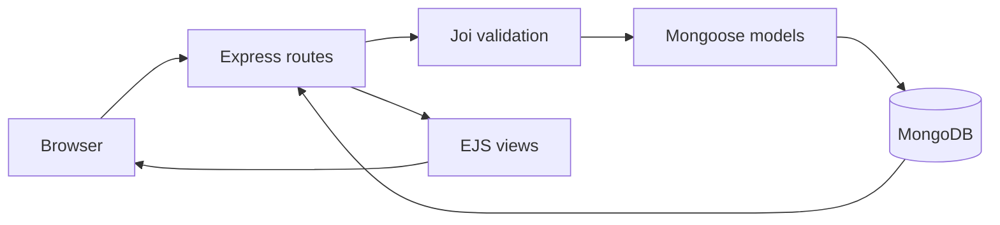

# Wanderlust

> A full-stack travel-stay listing platform built with Express, MongoDB, and server-rendered EJS views.

Wanderlust is a CRUD web application for browsing and managing travel stays. Users can explore a catalogue of properties, view listing details, create and update listings, and share ratings and written reviews. The project demonstrates practical backend fundamentals: RESTful routing, relational data modelling with MongoDB references, server-side validation, reusable UI templates, and centralized error handling.

## Why this project

This project was built to apply full-stack development concepts in a real application flow—not just isolated exercises. It turns user input into validated MongoDB documents, renders dynamic pages from persisted data, and keeps related reviews consistent when a listing is removed.

## Features

- **Listing management:** Create, read, update, and delete travel listings.
- **Review system:** Add 1–5 star ratings and comments to individual listings; delete reviews when needed.
- **Data integrity:** Reviews are linked to listings through MongoDB object references and are cleaned up when their listing is deleted.
- **Validation at two layers:** Bootstrap provides client-side feedback, while Joi protects server routes from invalid listing and review payloads.
- **Resilient request handling:** Async routes are wrapped to forward errors to a centralized custom error handler and friendly error page.
- **Reusable server-rendered UI:** EJS, ejs-mate layouts, partial navigation, and footer components keep views consistent.
- **Starter data:** A seed script loads 27 sample travel stays to make the application immediately explorable.

## Tech stack

| Layer | Technology |
| --- | --- |
| Runtime | Node.js |
| Web framework | Express.js |
| Database | MongoDB with Mongoose ODM |
| Templating | EJS and ejs-mate |
| Validation | Joi and Bootstrap form validation |
| HTTP method support | method-override |
| UI | Bootstrap, custom CSS, Font Awesome, Google Fonts |
| Development tooling | Nodemon and concurrently |

## Application flow



## Quick start

### Prerequisites

- [Node.js](https://nodejs.org/) 18 or later
- [MongoDB Community Server](https://www.mongodb.com/try/download/community), running locally

The app connects to:

```text
mongodb://127.0.0.1:27017/wanderlust
```

### Installation

```bash
git clone https://github.com/YOUR-USERNAME/wanderlust-travel-listings.git
cd wanderlust-travel-listings
npm install
```

### Run locally

Start MongoDB in a separate terminal:

```bash
mongod
```

Seed the database with the included sample listings. **This removes existing listing data**, so use it only for a fresh local setup:

```bash
node init/index.js
```

Start the main app:

```bash
node app.js
```

Open [http://localhost:8080/listings](http://localhost:8080/listings) in your browser.

### npm scripts

```bash
# Starts MongoDB when available, then starts Wanderlust
npm start

# Starts Wanderlust (port 8080) and the separate classroom practice server (port 3000)
# with automatic restarts
npm run dev
```

## RESTful routes

### Listings

| Method | Endpoint | Purpose |
| --- | --- | --- |
| GET | `/listings` | Display all listings |
| GET | `/listings/new` | Render the create-listing form |
| POST | `/listings` | Create a listing |
| GET | `/listings/:id` | Display a listing and its reviews |
| GET | `/listings/:id/edit` | Render the edit form |
| PUT | `/listings/:id` | Update a listing |
| DELETE | `/listings/:id` | Delete a listing and its associated reviews |

### Reviews

| Method | Endpoint | Purpose |
| --- | --- | --- |
| POST | `/listings/:id/reviews` | Add a review to a listing |
| DELETE | `/listings/:id/reviews/:reviewId` | Remove a review |

> Browser forms use `method-override` to make `PUT` and `DELETE` requests possible.

## Project structure

```text
.
├── app.js                  # Express setup, MongoDB connection, middleware, error handling
├── models/
│   ├── listing.js           # Listing schema and review cleanup middleware
│   └── review.js            # Review schema with rating constraints
├── routes/
│   ├── listing.js           # RESTful listing CRUD routes
│   └── review.js            # Nested review routes
├── views/
│   ├── layouts/             # Shared EJS page layout
│   ├── includes/            # Navbar and footer partials
│   └── listings/            # Index, new, edit, and show pages
├── public/
│   ├── css/                 # Custom application styling
│   └── js/                  # Client-side Bootstrap validation
├── init/                    # Seed dataset and database initialization script
├── utils/                   # Async wrapper and custom Express error class
├── schema.js                # Joi request-validation schemas
├── start.sh                 # Local MongoDB and application startup helper
└── classroom/               # Separate Express routing and cookie practice module
```

## Implementation highlights

- **Nested resources:** Review routes use Express `mergeParams` so every review operation remains scoped to its parent listing.
- **Cascade cleanup:** A Mongoose `findOneAndDelete` hook removes reviews referenced by a deleted listing.
- **Safe async routing:** A reusable `wrapAsync` helper eliminates repetitive `try/catch` blocks while keeping errors centralized.
- **Default-image handling:** Empty image URLs are normalized so listings retain a usable fallback image.
- **Separation of concerns:** Models, routes, validation schemas, utilities, views, and static assets are kept in dedicated folders.

## Classroom module

The `classroom/` directory is intentionally kept separate from Wanderlust. It is a small Express practice server that demonstrates modular routers and signed cookies on port `3000`. The main portfolio project is the Wanderlust application in the repository root.

## Planned improvements

- Authentication, authorization, and listing ownership
- Cloud-based image uploads
- Search, filters, and map-based discovery
- Pagination and improved accessibility
- Automated tests, CI, and production deployment

## License

This project is licensed under the [ISC License](https://opensource.org/license/isc-license-txt/).
